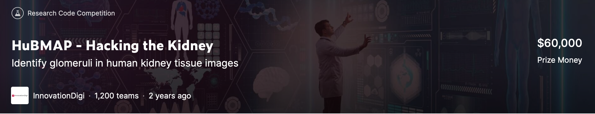

# Kaggle HuBMAP - Hacking the Kidney

[Kaggle page](https://www.kaggle.com/c/hubmap-kidney-segmentation)

This competition, “Hacking the Kidney," starts by mapping the human kidney at single cell resolution. Your challenge is to detect functional tissue units (FTUs) across different tissue preparation pipelines.

The solution uses U-net architecture and different pre- and post-processing. It provides a score 0.9484 on the Private Leaderboard.
